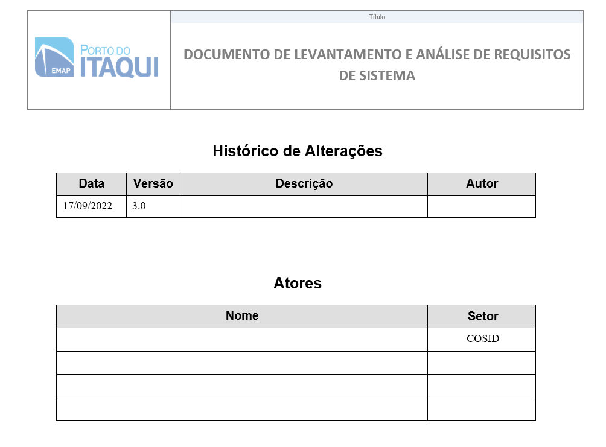
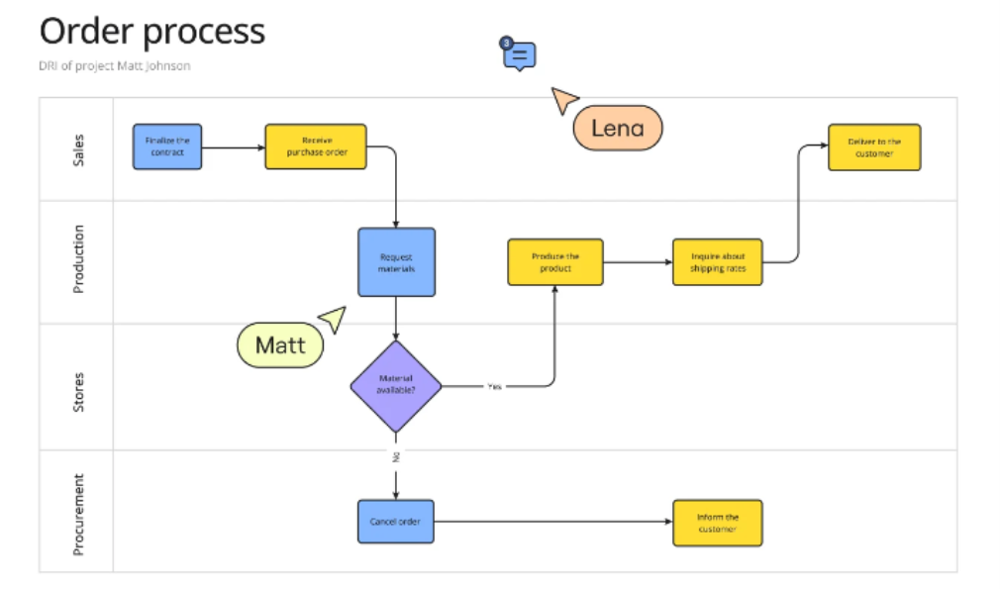
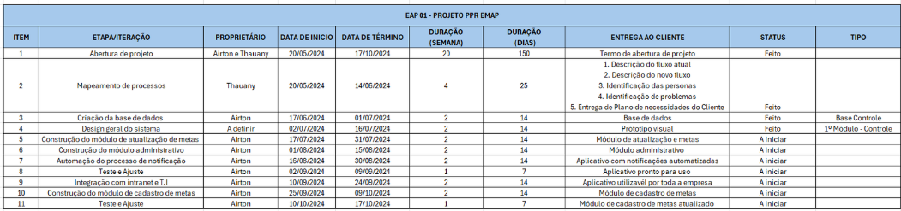

# Ciclo de Desenvolvimento de Software

O Ciclo de Vida de Desenvolvimento de Software (SDLC - Software Development Life Cycle) é um processo estruturado usado para planejar, criar, testar, implantar e manter sistemas de software. Ele é essencial para garantir que o software seja desenvolvido de forma eficiente, dentro do prazo, orçamento e com qualidade. O SDLC inclui etapas distintas, cada uma com objetivos claros. As principais fases são:

- Análise de Requisitos
- Planejamento dos desenvolvedores
- Design
- Desenvolvimento e Implementação
- Testes
- Deploy (Implantação)
- Manutenção (Monitoramento)

Dentro do contexto da Gerência de Pesquisa, Desenvolvimento e Inovação (GEPDI), o modelo de SDLC apresenta um padrão similar, tanto para o desenvolvimento de produtos Low Code, quanto para desenvolvimento utilizando linguagem de programação de alto nível, cada etapa do Ciclo de Vida do Desenvolvimento de Software será explicada durante os próximos capítulos contendo uma estrutura textual de Descrição > Entradas (inputs) > Entregáveis > Responsáveis, além de boas práticas.

## Análise de Requisitos

---
A análise de requisitos, dentro ciclo de desenvolvimento de produtos tecnológicos da GEPDI, consiste em uma etapa pós aplicação das metodologias de mapeamento definidos no Guia de Mapeamento de Projetos (cap. 4), onde o time de desenvolvimento realiza uma etapa de entendimento do problema e avaliação das ferramentas necessárias para o desenvolvimento da solução proposta.
### Definição

A análise de requisitos consiste em entender o problema que o software deve resolver, o que o sistema precisa fazer (requisitos funcionais) e as restrições que ele deve respeitar (requisitos não funcionais). Essa fase visa reduzir ambiguidades e garantir que todos os envolvidos no projeto tenham uma compreensão alinhada sobre o escopo e os objetivos.
### Entradas

Como entradas para a etapa de análise de requisitos no desenvolvimento de uma solução de base tecnológica, utilizam-se de reuniões, entrevistas e questionários (estruturados ou não-estruturado), que resultam em uma base de informações essencial para o time de Dados e Desenvolvimento realizar a análise de requisitos. Essa análise é direcionada ao desenvolvimento de um produto com o mínimo de funcionalidades entregáveis. 
No Guia de Mapeamento de Projetos, capítulo “Metodologia de Mapeamento” (consultar documento), ao se tratar de desenvolvimento de produtos de base tecnológica, o processo é dividido em 4 etapas com seus respectivos entregáveis, que posteriormente serão utilizados como entradas para o processo de análise de requisito: 
### Entregáveis

Todos os requisitos de desenvolvimento devem ser formalmente documentados e aprovados antes do início de qualquer projeto. Isso inclui a assinatura física ou eletrônica dos responsáveis das áreas de negócio. Conforme política já estabelecida, as informações podem ser acessadas na intranet acessando a seguinte url: Documento de Requisitos. 
A etapa de análise de requisitos, requer como entregáveis o documento de análise de requisitos (Intranet > Sistema de Gestão de Segurança da Informação > Procedimentos > EMAP-PC-72 > Documento de levantamento e análise de requisitos de sistema). 

### Responsáveis
A etapa de análise de requisitos de projetos de base tecnológica é de responsabilidade de toda a equipe de desenvolvedores do projeto, além do PO responsável. 

## Planejamento

---
### Definição
A fase de planejamento envolve a criação de um roadmap detalhado do projeto. O objetivo principal é identificar os requisitos, definir as metas, estabelecer o escopo, priorizar funcionalidades e criar cronogramas realistas. Essa fase também aborda a alocação de recursos, identificação de riscos e planejamento de estratégias de mitigação.

### Entradas
Os inputs para o produto da etapa de planejamento são:
- Project Brief: Requisitos iniciais dos clientes
- Documento de análise de requisito: informações iniciais sobre o que o software deve fazer.
- Ferramentas de gestão de projetos: Planner e Excel 

### Entregáveis
Os produtos gerados nessa fase incluem os entregáveis produzidos pela etapa de Elaboração de roadmap + cronograma de projeto, detalhados no Guia de Mapeamento de projetos, etapa 5 (Proposta de produto de base tecnológica) :
- Plano de projeto: Contendo cronograma, fluxograma.
- Definição do escopo: Limites do projeto e lista de exclusões.

#### FLuxograma 
Documento utilizado na 4ª Etapa - Validação de  ideias e 5ª Etapa - Proposta de produto (Para produtos de base tecnológica) do Mapeamento de Processos: deverá ser preenchido pelo PO, de acordo com as boas práticas de fluxos de mapeamento de processos, respeitando as simbologias e métodos padrões.

#### Cronograma
Documento utilizado na 5ª Etapa - Proposta de produto do Mapeamento de Processos: deverá ser preenchido pelo PO para que o Time do Projeto se guie nos prazos e entregas do produto.

### Responsáveis
A etapa de análise de requisitos de projetos de base tecnológica é de responsabilidade de toda a equipe de desenvolvedores do projeto, além do PO responsável. 

## Design
Como definido pelo Documento “Guia de Diretrizes Arquiteturais para Desenvolvimento de Software da EMAP”, assegurar que todas as novas interfaces sigam os padrões visuais existentes e sejam responsivas, adaptando-se a diferentes dispositivos e resoluções. Recomendamos entrar em contato com a Gerência de comunicação para esclarecimentos sobre uso da marca e suas aplicações, o manual de uso está disponível em:  A EMAP.

---
### Definição
A etapa de design é responsável pela concepção visual e pela definição da experiência do usuário (UX/UI) para os produtos tecnológicos desenvolvidos pelo setor. Utilizando ferramentas como Figma e Canva, a equipe de design cria protótipos, mockups e layouts funcionais que servem como base para o desenvolvimento técnico, alinhando-se aos requisitos do projeto e às expectativas do cliente interno ou externo.

### Entradas
As metodologias de mapeamento de projetos apresentadas no Guia de Mapeamento de Projetos produzem entregáveis importantes para o desenvolvimento do design do produto, captando necessidades do cliente e funcionalidades essenciais, dentre esses produtos de input resultantes do Guia de Mapeamento de Projeto, temos:
- 2ª Etapa Alinhamento de expectativas
    - Reunião estruturada com o cliente
    - Aplicar formulário pós-entrevista
- 4ª Etapa Validação de Ideias
    - Elaboração do mapeamento do fluxo atual do processo 
    - Elaboração do mapeamento do fluxo ideal do processo 

### Entregáveis
- Wireframes: Estrutura básica e hierarquia das telas, criada para testar fluxos e organização visual (preferencialmente no Figma).
- Designs finais de interface (UI): Modelos completos com elementos visuais detalhados, criados no Canva ou no Figma, dependendo da complexidade.
- Especificações para desenvolvimento: Documentos ou anotações no design que detalham dimensões, cores e comportamento de cada elemento.

### Responsáveis
O design do produto de base tecnológica tem como responsáveis a equipe de  design do Time de Transformação digital, no entanto, o P.O do projeto também assume a responsabilidade pelo desenvolvimento do mockup, a partir de sua proximidade com o cliente e time de desenvolvedores, facilitando a execução da tarefa.

## Desenvolvimento
Este capítulo será dividido em duas etapas descrevendo as metodologias e boas práticas do desenvolvimento de produtos tecnológicos utilizando ferramentas Low Code e linguagem de programação de alto nível. As etapas pré desenvolvimento também serão descrita nesse capítulo, sendo essas, **Modelagem de dados > Criação de projetos > Documentação**.

---
### Definição
A etapa de desenvolvimento envolve todo o processo de prototipação do produto definido juntamente com o P.O e stackholders, podendo ser um site, uma API, ou um aplicativo, desenvolvido utilizando tecnologia Low Code ou linguagem de programação de alto nível. 

### Entradas
A etapa de desenvolvimento exige como entrada primeiramente o desenvolvimento do documento de requisitos contendo as funcionalidades/features do produto, além de,  o desenvolvimento do mock-up realizado pelo responsável da etapa de design.

### Entregáveis
Como entregáveis da fase de desenvolvimento, o protótipo (MVC) do produto será o primeiro entregável, juntamente com o documento de validação e documentação das funcionalidades já empregadas no produto.
 
### Responsáveis
Os responsáveis pela etapa de desenvolvimento são:

- Desenvolvedores ativos no projeto
- Time de Dados e Desenvolvimento

### Produtos de Desenvolvimento

| Produto         | Diretriz    | 
| --------------- | ----------- |
| Low Code        | [Guia de Desenvolvimento Low Code](desenvolvimento-low-code.md) |
| Aplicação Streamlit | [Guia de Desenvolvimento Streamlit](desenvolvimento-streamlit.md) |
| Aplicação Django | [Guia de Desenvolvimento Django](desenvolvimento-django.md) |
| Aplicação FastAPI | [Guia de Desenvolvimento FastAPI]() |
| Ciencia de dados aplicada a portos | [Guia de Desenvolvimento Análise de dados aplicada a portos]() |

## Teste

A etapa de testes geralmente envolve a execução de diferentes tipos de testes, como testes unitários, testes de integração, testes de sistema, testes de aceitação, entre outros. O presente capítulo será dividido entre teste de usuabilidade  e Testes unitários, sendo esse divido entre teste de soluções Low Code e teste para soluções desenvolvidas com linguagem de programação de alto nível.

### Definição

A etapa de testes no ciclo de desenvolvimento de software tem como objetivo validar a funcionalidade, a performance e a estabilidade do sistema, garantindo que o software desenvolvido atenda aos requisitos definidos e funcione corretamente antes de ser lançado. Durante essa fase, diversos tipos de testes são realizados para identificar erros ou falhas no código, bem como para assegurar que o sistema seja robusto, seguro e eficiente. 

### Entradas

- Código-fonte do sistema desenvolvido ou do módulo em questão.
- Requisitos funcionais e não funcionais definidos para o software.
- Documentação de especificação do sistema ou histórias de usuário.
- Ambiente de teste configurado, incluindo bancos de dados e servidores necessários.
- Scripts e ferramentas de teste automatizado (caso aplicável).
- Resultados dos testes anteriores, como testes unitários ou testes de integração realizados pelos desenvolvedores.

### Entregáveis

- Relatórios de testes, indicando falhas encontradas e seu status de resolução.
- Lista de defeitos ou bugs identificados e documentados.
- Resultados de testes de desempenho, segurança, usabilidade e carga, caso aplicável.
- Código corrigido, caso problemas sejam encontrados.
- Relatório final com uma visão geral do sucesso dos testes, incluindo a cobertura de testes e a qualidade geral do software.

### Responsáveis

Os responsáveis pela etapa de desenvolvimento são: 
- Desenvolvedores ativos no projeto
- Gerente de projetos ou líder técnico, para assegurar que todas as etapas foram seguidas corretamente e comunicar ao cliente ou usuários sobre a disponibilidade do sistema.
- Testadores automatizados, se a equipe utilizar ferramentas de automação para testes de regressão ou performance.

#### Teste de usuabilidade

(Em Contrução)
: Durante o desenvolvimento do cronograma (mapeamento de processos), os P.O's juntamento com desenvolvedores estabelecem marcos baseados em entregas de módulos para aplicação dos testes de usabilidade. Dessa forma, durante o desenvolvimento, aplica-se o teste, tornando o processo mais fluido e captando possíveis bugs antes da entrega final. Essa aplicação será uma entrega das validações semanais. 

## Deploy 
(Em contrução)
### Deploy de aplicativos Power Apps
### Deploy de Aplicações Web
### Deploy de aplicativos Power BI

## Monitoramento
(Em contrução)
### Validação
### Report

