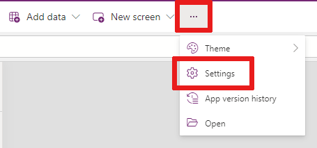
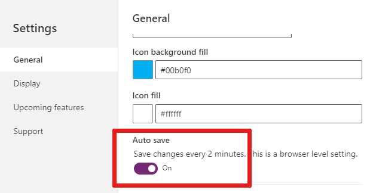
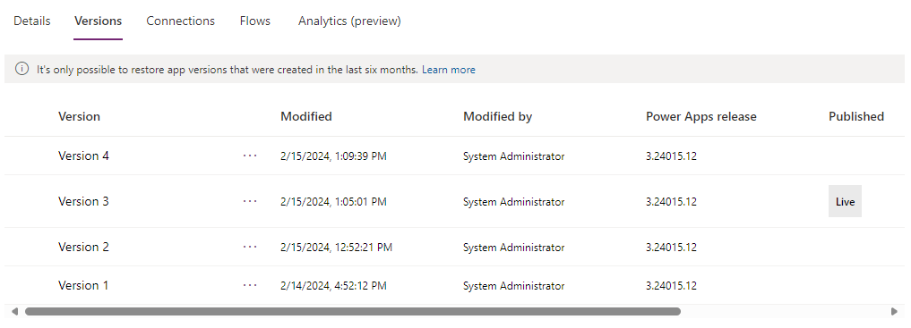

# Deploy de aplicativos Power Apps

No desenvolvimento de soluções no Power Apps, sempre que as alterações em um aplicativo de tela forem salvas,
elas serão publicadas automaticamente apenas para você e qualquer outra pessoa que tenha 
permissões para editar o aplicativo. Ao terminar as alterações, você precisa publicá-las explicitamente a 
fim de disponibilizá-las para todas as pessoas com as quais compartilha o aplicativo.

### Salvando seu aplicativo

Selecione Salvar  para salvar as alterações não salvas feitas no aplicativo. A cada salvamento, uma nova versão será criada no Histórico de versões do aplicativo.

### Ativar ou desativar o Salvamento Automático

Selecione Mais ... > Configurações.

Selecione a guia Geral -> Na seção Salvamento automático, defina o botão de alternância 
Salvamento automático como Ativado ou Desativado.

### Identificar a versão ao vivo

Para ver todas as versões de um aplicativo:

- Acesse Power Apps > Aplicativos.
- Selecione o  ao lado de um nome de aplicativo.
- Selecione Detalhes e, em seguida, selecione a guia Versões.

A versão Ao vivo é publicada para todas as pessoas com quem o aplicativo é compartilhado.
 A versão mais recente de qualquer aplicativo estará disponível somente para usuários que têm permissões para editá-lo.

