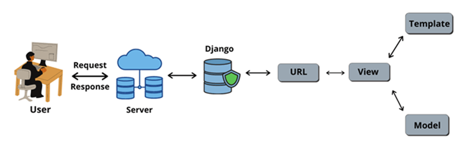
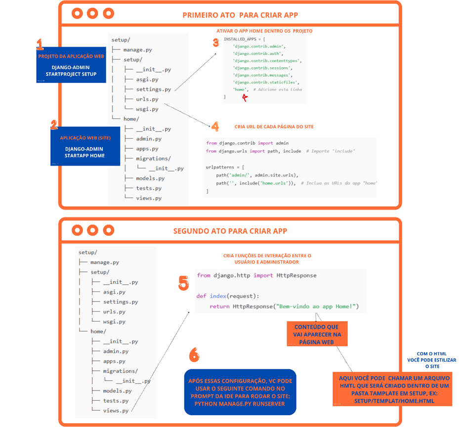

# Aplicação Django

O django é um framework web Python de alto nível que incentiva o desenvolvimento rápido e o design limpo e pragmático. Essa ferramenta é gratuita e de código aberto com vantagens de ser extremamente rápido, seguro e escalável. 

Como o django possui um ambiente administrativo totalmente integrado, sua aplicabilidade está, na maioria das vezes, voltada para desenvolvimento de sistemas responsivos. Isso significa dizer que o usuário faz uma requisição na plataforma e o django processa aquele input retornando um output. Na figura abaixo podemos ter uma ideia de como ocorre essa comunicação. 

Observe que dentro do django existem três arquivos que são extremamente importantes para o desenvolvimento. Os arquivos de view.py, template.py e model.py. Claro que o arquivo url.py é extremamente importante para declararmos os diretórios que a aplicação deve ter.  Comparado ao streamlit, o django permite desenvolver mockups mais personalizados e dinâmicos, sem comprometer algumas de suas características como rapidez de reposta do sistema.

Para iniciarmos um projeto com o django, é necessário considerar algumas das etapas declaradas no desenvolvimento com streamlit, como exemplo a criação de um ambiente virtual. Nele, você pode facilmente instalar o framework e começar a sua aplicação. É importante destacar, que diferente do streamlit (onde tudo pode-se desenvolver em um único script) o django possui uma arquitetura que conta com vários arquivos de manipulação, como exemplo os arquivos mencionados com parágrafo anterior. 

Após a instalação do django no ambiente virtual, o desenvolvedor está apto a criar seu projeto com django-admin startproject setup. Com o django-admin é possível criar toda a arquitetura de um projeto com de nome setup, com todos os arquivos necessários para manipulação e transcrição de uma ideação.  No esquema abaixo nota-se a arquitetura de um projeto, inicialmente chamamos atenção para os arquivos url.py e settings.py. O arquivo url.py é bastante útil para declarar o caminho das paginas web, essas últimas são criadas semelhantes a criação do projeto, porém ao invés de usar starproject usa-se starapp, segue exemplo dos atos para desenvolver a aplicação: 

Após seguir todos os atos você está minimamente apto para desenvolver sua primeira aplicação. Mas lembre-se esse guia não substitui a documentação do django ou de qualquer outra biblioteca/framework. Por isso, para se aprofundar nas funcionalidades do django leia a documentão disponível em: [Documentação Django](https://docs.djangoproject.com/pt-br/5.1/)