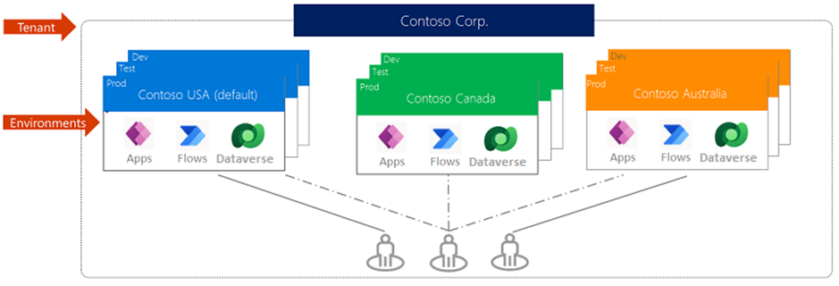
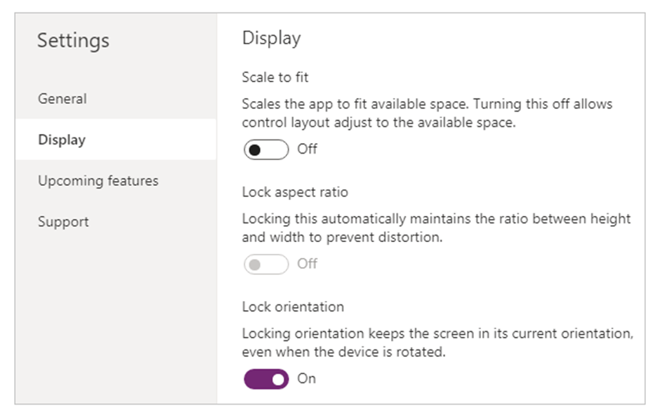
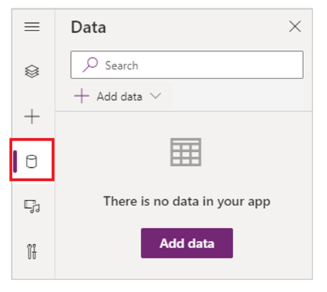
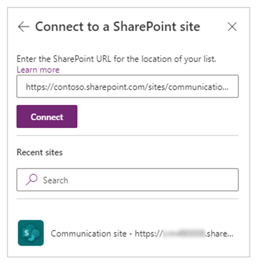
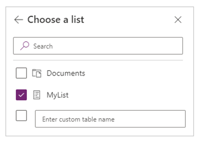

# Desenvolvimento Low Code
O desenvolvimento low code é ideal para soluções de menor escala, demandas urgentes e funcionalidades menos complexas. No contexto da GEPDI, as soluções baseadas em ferramentas de desenvolvimento low code são voltadas principalmente para projetos de uso interno, atendendo exclusivamente aos colaboradores do complexo portuário.
Para o desenvolvimento dessas aplicações, utilizamos as ferramentas da Power Platform (Microsoft), especificamente: Power App, Power Automate e Power BI.

.png)

> ## Power apps 
> Power Apps é um conjunto de aplicativos, serviços e conectores, bem como uma plataforma de dados que oferece um ambiente de desenvolvimento rápido de aplicativos para criação dos apps personalizados para suas necessidades de negócios. Utilizando da linguagem Power Fx, desenvolvida pela Microsoft, com o Power Apps, você pode criar rapidamente aplicativos de negócios personalizados que se conectam aos seus dados armazenados na plataforma de dados subjacente (Microsoft Dataverse) ou em muitas fontes de dados on-line e local (como SharePoint, Microsoft 365, Dynamics 365, SQL Server e assim por diante). 

> ## Power Automate
> O Power Automate é uma ferramenta que permite a automação de fluxos de trabalho entre aplicativos e serviços, promovendo maior eficiência e redução de tarefas manuais. Ele oferece um ambiente intuitivo de desenvolvimento de automações, possibilitando a integração com diversas fontes de dados e sistemas, como SharePoint, Microsoft 365, Dynamics 365, SQL Server, entre outros. Com o Power Automate, é possível criar fluxos de trabalho automatizados para notificações, aprovações, sincronização de dados, entre outras funcionalidades.

> ## Power BI
> O Power BI é uma ferramenta de análise e visualização de dados que permite transformar informações em insights valiosos para a tomada de decisão. Ele possibilita a conexão com diversas fontes de dados, tanto locais quanto na nuvem, como SharePoint, Microsoft 365, SQL Server, Dynamics 365, entre outros. Com o Power BI, é possível criar relatórios e dashboards interativos, fornecendo uma visão clara e objetiva do desempenho e indicadores chave.

> ## Power Agents
> Os agents da Power Platform são componentes da plataforma da Microsoft voltados para a criação e utilização de bots de conversa automatizados, conhecidos como Power Virtual Agents. Esses bots são projetados para interagir com usuários, automatizar tarefas, responder a perguntas e integrar-se com outros serviços da Microsoft e de terceiros.

# Aplicação Low Code
O desenvolvimento de produtos tecnológicos feitos pela GEPDI, utilizando ferramentas Low Code, geralmente é composto pelo conjunto de ferramentas fornecido pela Power Platform e microsoft 365 (Power Apps, Power Automate, Power BI, SharePoint).  Seguindo essa premissa, alguns passos padrões pra o desenvolvimento do aplicativo deverão ser seguidos com o objetivo de desenvolver um produto com boas práticas, permitindo uma manutenção menos complexa. Dentre essas etapas temos: (definição do ambiente > criação do aplicativo > configurações de tela > conexão com lista ou banco de dados > codificação utilizando boas práticas).

## Ambientes power platform 
Um ambiente do Power Platform é um espaço para armazenar, gerenciar e compartilhar dados corporativos, aplicativos, chatbots e fluxos da sua organização. Ele também serve como um contêiner para separar aplicativos que podem ter diferentes funções, requisitos de segurança ou público-alvo. A maneira escolhida para usar os ambientes depende de sua organização e dos aplicativos que você está tentando criar. Devido a necessidade de acesso por todos da organização e necessidade de um ambiente adequado para prototipação e teste, por padrão, a GEPDI utiliza o ambiente padrão (default) para armazenar todos os aplicativos lançados.

## Criação de ambiente
Para a criação de um aplicativo de tela em branco. As próximas etapas incluem configurar a funcionalidade do aplicativo e, dependendo do seu cenário de negócios, adicionar as conexões e fontes de dados necessárias.
- Entre no Power Apps e, se necessário, alterne os ambientes.
- No painel de navegação esquerdo, selecione Criar > Aplicativo em branco.
- Entre as opções disponíveis, selecione Criar em Aplicativo de tela em branco.
- Insira um nome do aplicativo.
- (Opcional) Escolha um formato diferente para o aplicativo.
- Selecione Criar para criar um aplicativo de tela em branco.

## Configuração da tela
A configuração de tela é uma etapa importante para que seu layout se adapte ao espaço real em que o aplicativo está sendo executado.
Você ativa a capacidade de resposta desativando a configuração ajustar para caber do aplicativo, ativada por padrão. Quando você desativa essa configuração, também desativa Bloquear taxa de proporção porque você não está mais projetando para um formato de tela específico. (Você ainda pode especificar se seu aplicativo suporta a rotação do dispositivo.)

## Conexão com SharePoint List
No Power Apps Studio, abra o aplicativo que você deseja atualizar, selecione Dados no painel esquerdo.

Selecione Adicionar dados > Conectores > SharePoint.
Em Conectar a um site do SharePoint, selecione uma entrada na lista Sites recentes (ou digite ou cole a URL do site que você deseja usar) e, em seguida, selecione Conectar.

Em Escolha uma lista, marque a caixa de seleção de uma ou mais listas que deseja usar e clique ou selecione Conectar:

## Boas práticas
- Deve-se evitar utilização de cadeias de galerias invisíveis interconectadas durante a codificação dentro das aplicações. Essa prática aumenta a complexidade da documentação e manutenção do código por terceiros.
- Manter documentação do aplicativo sempre atualizada seguindo as indicações do Guia de Documentação.
- Manter os padrões de desenvolvimento recomendados na documentação oficial do Power Fx (linguagem utilizada pelo power apps):  [power-fx-documentação](https://learn.microsoft.com/pt-br/power-platform/power-fx/overview)
- ID (Chave Primária): A chave primária é um campo ou conjunto de campos que identifica cada linha de uma tabela de banco de dados. Ela é única para cada linha e não pode ter valores nulos. O SharePoint List possui por padrão uma coluna ID, de valores único, auto inteiráveis e imutáveis com o intuito de realizar a identificação de cada item da tabela.
- À medida que os aplicativos de tela evoluem para atender a diversos requisitos de negócios, o desafio de manter o desempenho ideal torna-se uma consideração crítica. Nesse caso, é importante conhecimento em otimização de código a partir da documentação do power apps: Otimização de código. 
- A fim de evitar problemas durante consultas em banco de dados, a documentação do power apps recomenda o conhecimento em Noções Básicas de Delegação.
