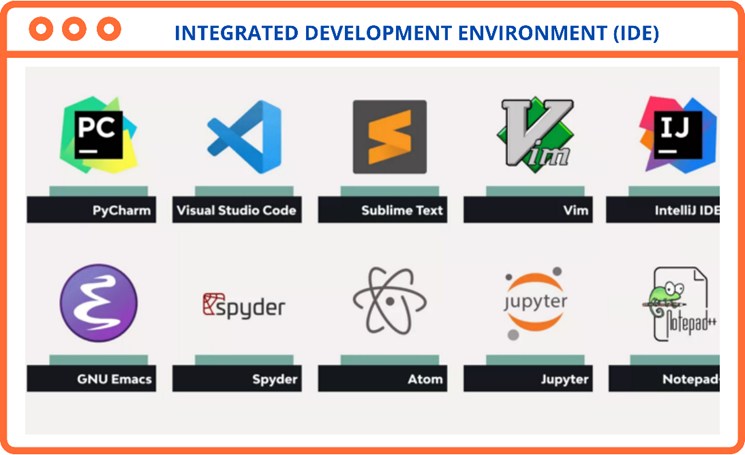
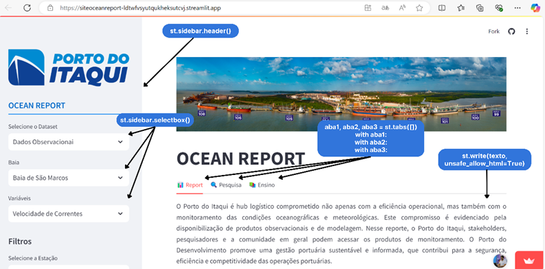
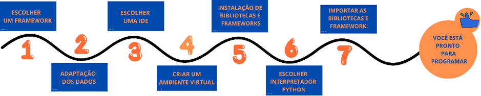

# Aplicação Streamlit


Streamlit é um framework Python de código aberto voltado para cientistas de dados e engenheiros de IA/ML, permitindo criar aplicativos dinâmicos de dados com apenas algumas linhas de código.

## Instalação
`pip install streamlit`

`streamlit hello`

## Integração de dados meteocoeanográficos 

Para criar o **Ocean Report**, é fundamental seguir um conjunto de etapas bem definidas, desde a escolha do framework até a modelagem dos dados e a configuração do ambiente de desenvolvimento. Abaixo, descrevemos o processo de forma detalhada e instrutiva.  

---

### Escolha do Framework Baseado na Análise de Requisitos  
- Avalie os requisitos descritos no **Capítulo 6 - Ciclo de Vida do Desenvolvimento de Software** antes de iniciar o desenvolvimento.  
- Selecione um framework que atenda às necessidades do projeto em termos de:  
  - Escalabilidade;  
  - Desempenho;  
  - Suporte a bibliotecas;  
  - Facilidade de manutenção.  
- Exemplos de frameworks que podem ser considerados incluem:  
  - **Streamlit**;  
  - **Dash**;  
  - **Django** ou **Flask** (para soluções web mais completas).  

---

### Verificação da Adaptação dos Dados às Limitações do Framework  
O framework escolhido pode impor restrições ao formato ou estrutura dos dados. Para garantir a compatibilidade:  
1. **Análise e Tratamento dos Dados**:  
   - Utilize bibliotecas como **Pandas**, **NumPy** e **Xarray** para manipular e organizar os dados:  
     - **Pandas**: Manipulação de dados tabulares e séries temporais;  
     - **NumPy**: Operações matemáticas de alto desempenho;  
     - **Xarray**: Ideal para dados multidimensionais, como conjuntos climáticos e oceanográficos.  
2. **Modelagem de Dados**:  
   - Consulte a subseção **Modelagem de Dados** para obter diretrizes sobre como estruturar os dados para análise e visualização eficazes.  
3. **Validação dos Dados**:  
   - Certifique-se de que os dados estejam no formato esperado pelo framework (ex.: JSON, CSV, ou arrays numpy).  

---

### Escolha da IDE para o Desenvolvimento  
A escrita do código deve ser feita em uma **Integrated Development Environment (IDE)** que facilite a organização, depuração e execução do projeto.  
- Recomendamos o uso do **Visual Studio Code (VSCode)** pelos seguintes motivos:  
  - Interface intuitiva que permite distinguir facilmente funções, variáveis e métodos;  
  - Suporte a extensões úteis para o desenvolvimento Python, como **Pylance**, **Jupyter** e **Python Extension**;  
  - Ferramentas integradas para controle de versão (Git) e depuração de código.  
- Outras opções viáveis incluem:  
  - **PyCharm**;  
  - **Jupyter Notebook**;  
  - **Spyder**.  



---

### Configuração do Ambiente Virtual  

A configuração de um ambiente virtual é uma etapa essencial para gerenciar as dependências de software de maneira eficiente em um projeto. Abaixo estão os passos recomendados para garantir uma configuração adequada:  

---

#### Criação do Ambiente Virtual  
- Crie um ambiente virtual dentro da pasta do projeto para facilitar sua organização e portabilidade.  
- Utilize o comando a seguir, dependendo do gerenciador de ambientes:  

  **Com `venv` (Python padrão):**  
  ```bash
  python -m venv venv

---

### Desenvolvimento Web com Streamlit  

Após concluir a configuração do ambiente virtual e instalar as dependências, você estará preparado para iniciar o desenvolvimento web, com as condições mínimas necessárias para dar vida à sua aplicação.  

No exemplo apresentado no case, utilizamos o framework **Streamlit**, uma ferramenta ideal para iniciantes no desenvolvimento de aplicações web. O Streamlit oferece um módulo integrado que simplifica a criação do front-end, eliminando a necessidade de desenvolver arquivos HTML ou CSS para personalizar as telas (mockups).  

---

### Escolha do Interpretador Python na IDE  

Ao utilizar o **Visual Studio Code (VSCode)**, é importante especificar o interpretador Python que será usado. Isso garante que o código seja executado no ambiente virtual configurado.  
1. Abra o VSCode e pressione `Ctrl+Shift+P` (ou `Cmd+Shift+P` no macOS).  
2. Digite **"Python: Select Interpreter"** e selecione a opção correspondente ao ambiente virtual criado.  
3. Certifique-se de que o nome do ambiente virtual está visível no canto inferior esquerdo da IDE.  

---

### Importação de Bibliotecas e Frameworks  

Mesmo que as bibliotecas e frameworks tenham sido instalados no ambiente virtual, é necessário importá-los no script do projeto para utilizá-los.  

**Exemplo inicial de importações:**  
```python
import streamlit as st
import pandas as pd
import numpy as np
```

---

Para criar sites com o Streamlit deve-se levar em consideração algumas funções básicas para estruturar as telas, segue exemplo:



### Estruturação do Mockup com Streamlit  

Antes de iniciar a função principal do app (função responsável pela criação do site – sites, softwares e afins são interpretados como app), criamos um **mockup** com barra lateral e abas. Esse mockup será utilizado para organizar e exibir as informações do banco de dados.

---

#### Criação de Abas  

Comandos como:  
```python
aba1, aba2, aba3 = st.tabs(["📊 Report", "🔍 Pesquisa", "📚 Ensino"])
with aba1:
with aba2:
with aba3:
```
São responsáveis por criar abas.

### Criação de Barras laterais

Comandos como:

``` python
St.sidebar.header(':blue[OCEAN_REPORT]', divider='blue')
```

São responsáveis por criar barras laterais para agregar informações como as de filtro.

### Criação de caixa de texto

Comandos como:
``` python
st.sidebar.selectbox( 'Selecione o Dataset', ('Dados Observacionai'))
```
São responsáveis por criar caixas de filtros que vão representar a natureza do banco de dados.

### Escrita de Texto

Comandos como:
``` python
st.write(texto, unsafe_allow_html=True)
```
São responsáveis pela escrita de texto.

Esses elementos são essenciais para a estruturação inicial do app, permitindo maior organização e interatividade com os dados apresentados.

Em outro contexto, poderíamos escrever dentro do app qualquer outra informação que desejamos repassar para os usuários, exemplo: Número de paradas operacionais, quantidade de tempo de navios atrasados, inventario de descarbonização etc. No final do desenvolvimento, o programador deve ter uma pasta contendo o ambiente virtual, um script contendo todas as linhas de código da sua aplicação e um banco de dados minimante adaptado para representar a realidade da informação que se deseja repassar para o usuário final.

Para saber mais sobre as aplicabilidades do Streamlit consulte a documentação: https://docs.streamlit.io/ . O esquema abaixo representa de forma sintetizada as etapas necessárias para iniciar o desenvolvimento de sua aplicação web com streamlit. 

