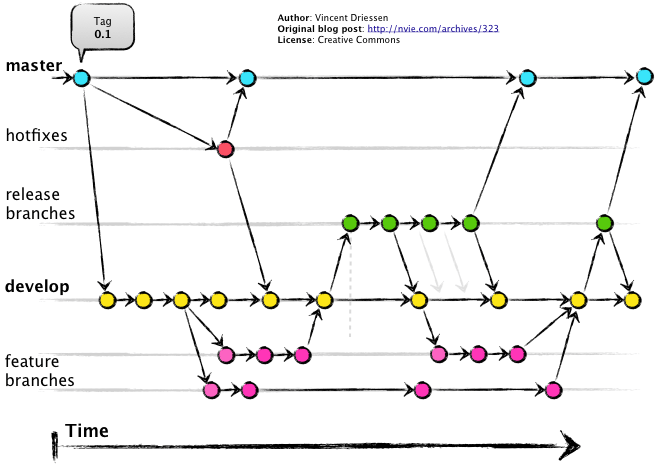
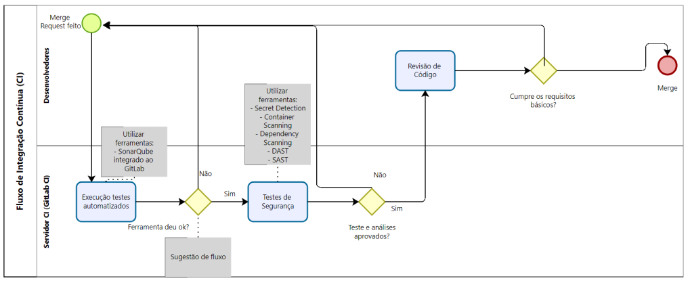
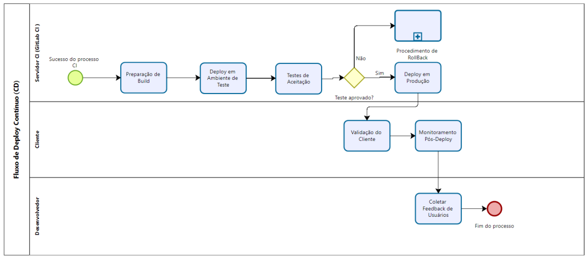

# Guia de Diretrizes de Desenvolvimento de Software da EMAP
A esteira de desenvolvimento de aplicações da GEPDI (Gerência de Pesquisa, Desenvolvimento e Inovação), segue as indicações sugeridas pelo documento, “Guia de Diretrizes Arquiteturais para Desenvolvimento de Software da EMAP”, desenvolvido pela GETIN – EMAP, que tem como objetivo definir a arquitetura básica e os conceitos fundamentais dos sistemas desenvolvidos e/ou sustentados pela GETIN – COSID.

Neste capítulo teremos algumas das boas práticas e diretrizes descritas pelo Guia de Diretrizes Arquiteturais para Desenvolvimento de Software da EMAP.

O documento “Guia de Diretrizes Arquiteturais para Desenvolvimento de Software da EMAP” desenvolvido pela GETIN-COSID tem como público alvo equipes de desenvolvimento da EMAP, fábrica de software terceirizada e outras áreas relacionadas.

# Processo de trabalho
## Formalização e Documentação de requisitos
Todos os requisitos de desenvolvimentos devem ser formalmente documentados e aproados antes do início de qualquer projeto. Isso inclui assinatura física ou eletrônica dos responsáveis da área de negócio. Conforme política já estabelecida, as informações podem ser acessadas na intranet, acessando a seguinte url: https://emapmagovbr.sharepoint.com/sgsi.

## Gestão do código fonte
Utilizamos o GitLab, para gerenciar todas as versões do código fonte. Para a criação de perfis de acesso ao GitLab, deve ser enviado ao service desck uma solicitação.

## Treinamento em segurança
Treinamentos regulares serão realizados para todos os desenvolvedores sobre segurança e práticas de desenvolvimento seguro, abordando as últimas tendências e vulnerabilidades.

# Infraestrutura de Desenvolvimento

## Chamados para Demandas de Infraestrutura
As áreas devem abrir chamados através do sistema de gestão de chamados da EMAP: [Service Desk](https://centraldeservicos.emap.ma.gov.br) para qualquer demanda relacionada à infraestrutura. Exemplos:
- Criação de usuário de rede
- Solicitação de Acesso ao Repositório de código - GitLab 

A GETIN proverá a infraestrutura necessária ao desenvolvimento, assim composta:
- Ambiente com container - DOCKER
- Repositório GitLab 
- Esteira de desenvolvimento DevSecOps

## Requisitos arquiteturais comuns
- A comunicação entre camadas de backend e front-end deverá seguir o padrão REST API.
- As integrações entre soluções e a obtenção de dados corporativos deverão ser feitas chamadas REST a web services.
- A concepção de novas soluções deverá ser agnóstica com relação à infraestrutura de produção, ou seja, não pode estar vinculada a produtos específicos de provedores nem fornecedores de soluções externas a EMAP. Além disso, deverá, preferencialmente, seguir a arquitetura definida pela GETIN. 
- A autenticação de usuários internos deverá ser feita por meio do Portal de Acessos.
- O controle de permissões de acesso deverá ser feito por meio do Portal de Acessos.
- Padrões de codificação:
    - Sugestão de definições apresentadas em https://google.github.io/styleguide/
    - Ao longo da esteira faremos verificações de padrões de código, testes automatizados, teste de segurança
    - Não serão aceitos diferentes padrões na mesma solução, por exemplo, nomeação de variáveis ou objetos em diferentes idiomas, nem usando diferentes estilos de codificação: camel case (ex: “camelCase”), snake case (ex: “snake_case”), kebab case (ex: “kebab-case”) etc.

# Ciclo de Desenvolvimento Seguro

## Uso do Portal de Acesso para Gestão de Autenticação
- Criação de Grupos e Perfis: Todas as aplicações desenvolvidas deverão integrar o portal de acesso para autenticação, utilizando a definição de grupos e perfis para gerenciar níveis de permissão. 
- Definição de Níveis de Permissão: Estabelecer regras claras de permissão em todas as aplicações para garantir que os acessos sejam concedidos conforme a necessidade e a função do usuário.

## Diretrizes de Segurança Conforme Política 72
- Proteção da Informação: Garantir a confidencialidade, integridade e disponibilidade das informações, adotando as melhores práticas de segurança sugeridas pela norma ISO/IEC 27002. 
- Monitoramento e Prevenção: Implementar controles sistemáticos para monitoramento e prevenção de incidentes de segurança, conforme detalhado na política.

## Ativação e Monitoramento de Trilhas de Auditoria
- Ativação de Trilhas de Auditoria: Todas as aplicações devem ativar trilhas de auditoria para logar atividades críticas, o que inclui acesso a dados sensíveis e alterações no sistema. 
- Necessidade de Descrição em Documentos de Projeto: Cada projeto deve documentar a implementação e o propósito das trilhas de auditoria, explicando como estas contribuem para a segurança e a conformidade das aplicações. 

## Práticas Conformes com ISO 27001
- Implementar e manter práticas de segurança que atendam aos padrões da ISO 27001, como detalhado nas políticas.

## Docekr
- Docker é utilizado para encapsular o ambiente de desenvolvimento e produção, garantindo que as aplicações sejam executadas de forma consistente em diferentes ambientes. Isso não apenas facilita o desenvolvimento e os testes, mas também melhora a segurança ao isolar as aplicações em contêineres, reduzindo as interdependências e possíveis falhas de segurança

## Ciclo CD/CI
- O ciclo de integração contínua (CI) e entrega contínua (CD) já está em operação para os projetos. Essa prática é crucial para a estratégia DevSecOps, pois permite a automação do processo de teste, integração, e entrega de software. Isso não apenas acelera o desenvolvimento, mas também introduz verificações de segurança automatizadas, como análises estáticas e dinâmicas de código, em cada etapa do desenvolvimento

## Padrões de Desenvolvimento e Estratégia de Branches
- Os padrões de desenvolvimento são definidos para manter a qualidade e consistência do código. A estratégia de branches, como Git Flow ou similar, é usada para gerenciar as mudanças de código de maneira organizada, facilitando a implementação de funcionalidades, correções e lançamentos sem interferir no desenvolvimento contínuo. A estratégia de branches também ajuda a integrar medidas de segurança nas revisões de código e nos merges, garantindo que as melhorias de segurança sejam implementadas de forma eficaz.

# Estratégia de Branches
A estratégia de branches deve ser projetada para apoiar o ciclo de vida do desenvolvimento do software, desde o desenvolvimento inicial até a produção. O uso do modelo escolhido será o Oneflow do "Gitflow" (OneFlow – a Git branching model and workflow): 

> **Branch master:** 
Serve como a principal linha de base do projeto, contendo o código que está em produção.

> **Branch develop:** 
Usada como a principal branch de desenvolvimento, onde todas as features, hotfixes e releases são mescladas antes de serem promovidas para a master. 

> **Branch feature:** 
Criadas a partir da develop, cada uma representando uma nova funcionalidade a ser desenvolvida

> **Branch release:** 
Preparam o próximo lançamento para produção, permitindo ajustes finais e preparação para o merge na master.

> **Branch hotfix:** 
Utilizadas para correções rápidas direto na branch master, que posteriormente são mescladas de volta na develop.

## Regras de Nomenclatura
- Branches de Feature: feature/nome-da-feature
- Branches de Release: release/versão
- Branches de Hotfix: hotfix/versão
- Branches de Bugfix: bugfix/nome-do-bugflix

## Padrão de Nomes de Branches de Feature 
Branches de feature devem seguir uma convenção clara que descreva o conteúdo da branch: 
- Formato: feature/descrição-curta-da-feature
- Exemplo: feature/novo_sistema_de_login 

## Padrão de nome de Tags
As tags são usadas para marcar pontos específicos na história do projeto que são importantes, como lançamentos de produção ou milestones.
- Tags de Feature: feat/nome-da-feature
- Tag de Produção: prod/versão

## Estratégia de Merge
O processo de merge deve ser gerenciado para manter a integridade do código e facilitar a integração contínua:
- De Feature para Develop: Após a conclusão e revisão de uma feature, ela é mesclada de volta na develop através de um Merge Request (MR), garantindo que todas as integrações e testes automáticos sejam passados. 
- De Develop para Main e Tags: Uma vez que a release está pronta para ir a produção, ela é mesclada na main, e uma tag de produção é criada para marcar a versão. 
- De Main para Develop: Após um hotfix ser aplicado na main, ele deve ser mesclado de volta na develop para garantir que as correções sejam aplicadas ao trabalho de desenvolvimento em andamento.

# Tecnologias suportadas
- Java com Spring Boot: Utilizado para o back-end robusto, aproveitando a estabilidade, a maturidade e a comunidade de desenvolvimento. Spring Boot facilita a configuração e o desenvolvimento de novos serviços, com grande suporte para segurança e configurações pré-definidas que aceleram o desenvolvimento e reduzem a possibilidade de erros. 
- Python: Ideal para scripts de automação e desenvolvimento rápido de aplicações backend, especialmente pela facilidade de leitura do código e pela ampla disponibilidade de bibliotecas. 
- React (incluindo React Native e Next.js): React JS é usado para criar interfaces de usuário dinâmicas com alto desempenho. React Native expande essas capacidades para o desenvolvimento de aplicativos móveis, enquanto Next.js oferece uma solução para aplicações server-side rendering (SSR), o que é crucial para SEO e performance inicial de carregamento. 
- Vue com Nuxt.js: Similar ao Next.js para React, Nuxt.js é um framework para aplicações Vue.js com renderização do lado do servidor, estruturação de projetos e configurações adicionais que melhoram a performance e a experiência do usuário. 
- Node.js: Usado no back-end, permite o desenvolvimento em JavaScript, facilitando a integração com as stacks front-end e a execução de operações assíncronas eficientes, essenciais para a construção de APIs rápidas e escaláveis.

# Importância do Uso Correto de Bibliotecas e Dependências 
O gerenciamento correto de bibliotecas e dependências é crucial para manter a segurança e a eficiência do ciclo de desenvolvimento. Isso afeta diretamente o pipeline de testes, pois dependências mal gerenciadas podem introduzir vulnerabilidades e bugs, além de complicar a atualização e a manutenção do código. Utilizar ferramentas como npm ou yarn para Node.js e Maven ou Gradle para Java pode ajudar a manter as dependências organizadas e seguras.

# Integração com a API TOSPWS 
A API TOSPWS é essencial para acessar informações operacionais críticas do sistema TOS+ no Porto do Itaqui. Para garantir a segurança e integridade dos dados, todas as interações com o sistema TOS+ devem ser realizadas exclusivamente através desta API. A autenticação é necessária para todas as operações, utilizando tokens com validade de 6 horas para assegurar acessos controlados. A utilização da API TOSPWS permite uma integração segura, consistente e eficiente, sendo crucial para a automatização e eficácia dos processos portuários.

# Esteira de Desenvolvimento
## CD/CD e Testes

- Serve como a principal linha de base do projeto, contendo o código que está em produção.

# Documentação

## Template e requisitos
Recomendamos o uso de templates existentes para documentação de requisitos e issues, com seções específicas para descrição de negócios, modelo de dados, e riscos.

## Atualização de Documentação de API
Trabalho em curso para atualizar e manter a documentação de API, garantindo que esteja acessível e clara para todos os usuários. 

# Referências e Boas Práticas
Para assegurar que as melhores práticas sejam seguidas, aqui estão alguns links úteis que podem ser incorporados ao documento de arquitetura:

- Boas Práticas de Desenvolvimento em Java/Spring Boot: [Spring Official Documentation](https://docs.spring.io/spring-boot/)
- Diretrizes para Python: [Python Best Practices Guide](https://www.developer.com/languages/python-best-practices/)
- React e React Native: [React Official Documentation](https://www.developer.com/languages/python-best-practices/)
- Next.js para SSR: [Next.js Documentation](https://nextjs.org/docs)
- Vue e Nuxt.js: [Vue.js Style Guide e Nuxt.js Documentation](https://nextjs.org/docs)
- Node.js Best Practices: [Node.js Best Practices](https://github.com/goldbergyoni/nodebestpractices)
- Git – melhores práticas - [git](https://git-scm.com/book/en/v2)
- One Flow - [One Flow](https://www.endoflineblog.com/oneflow-a-git-branching-model-and-workflow)