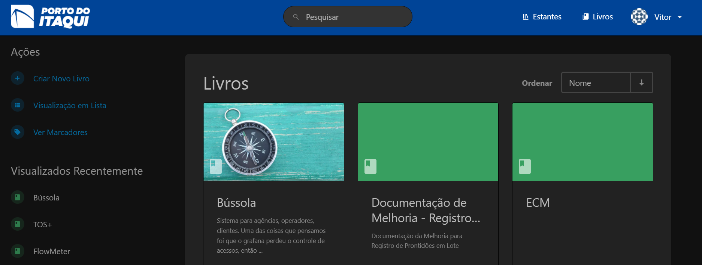
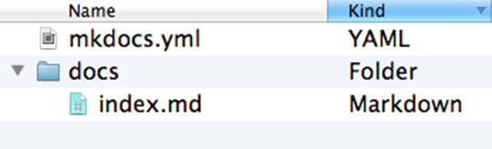
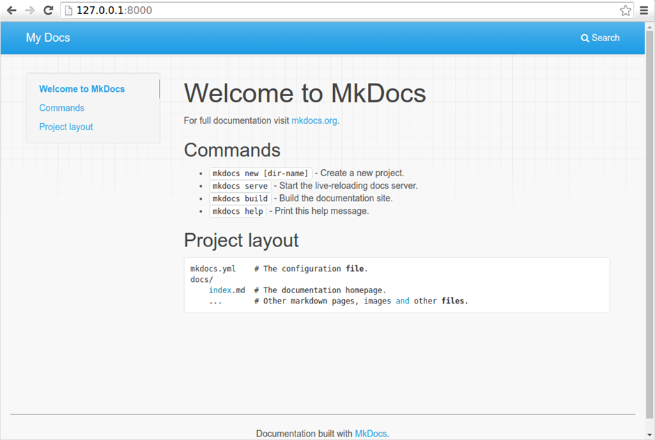

# Documentação técnica

A documentação técnica é uma etapa essencial no ciclo de desenvolvimento de software (SDLC, do inglês Software Development Life Cycle), garantindo que todas as partes interessadas tenham um entendimento claro sobre o sistema. Ela facilita a comunicação, a manutenção e a escalabilidade do projeto, servindo como referência durante todo o processo.

Para a documentação técnica das aplicações desenvolvidas, a GETIN solicita que os desenvolvedores utilizem do projeto docs, onde são compiladas todas as documentações de soluções desenvolvidas para o Porto do Itaqui. 

Dentro da Gerencia de Pesquisa, Desenvolvimento e Inovação, a documentação dos produtos tecnológicos se divide em: Aplicações Low Code e Aplicações de Alto nível. 

## Docs

O Docs é um sistema web desenvolvido para armazenamento e compartilhamento de documentações técnicas em formato de markdown das soluções de base tecnológica desenvolvidas para o Porto do Itaqui. O sistema é monitorado pela Gerência de Tecnologia da Informação (GETIN) e o acesso deve ser solicitado para a mesma via servicedesk.



## Intruções para documentação

A documentação técnica do projeto deve ser feita em formato markdown e recomenda-se a utilização da biblioteca MKdocs para o desenvolvimento do arquivo. 

MkDocs é um gerador de sites estáticos rápido, simples, voltado para a criação de documentação de projetos. Os arquivos de origem da documentação são escritos em Markdown e configurados com um único arquivo de configuração YAML.

### Instalação do MkDocs

Com o vscode aberto e localizada no repositório do projeto que deve ser documentado, para instalar o MKDocs, rode o seguinte comando na linha de comandos do terminal.

```
pip install mkdocs
```

### Criando um projeto docs

Para criar um novo projeto, execute o seguinte comando no terminal:

```
mkdocs new my-project
cd my-project
```



Há um único arquivo de configuração chamado mkdocs.yml e uma pasta chamada docs que conterá os arquivos de origem da sua documentação (docs é o valor padrão para a configuração docs_dir). Neste momento, a pasta docs contém apenas uma página de documentação, chamada index.md.

O MkDocs vem com um servidor de desenvolvimento integrado que permite visualizar sua documentação enquanto trabalha nela. Certifique-se de estar no mesmo diretório que o arquivo de configuração mkdocs.yml e, em seguida, inicie o servidor executando o comando:

```
mkdocs serve
```

Abra o endereço Para criar um novo projeto, execute o seguinte comando no terminal:



### Construindo site

Para publicar a primeira versão da sua documentação MkLorum. Primeiro, construa a documentação com o seguinte comando:

```
mkdocs build
```

Isso criará um novo diretório chamado site. Para mais informações e detalhes sobre a utilização do Mkdocs, consulte: [Documentação MkDocs](https://www.mkdocs.org/getting-started/)

## Estrutura básica de uma documentação técnica

A estrutura básica de uma documentação técnica de software deve ser bem organizada e clara, para facilitar a compreensão dos leitores, sejam eles desenvolvedores, usuários finais ou outros stakeholders. Abaixo estão os elementos essenciais que geralmente compõem uma boa documentação técnica:

- Overview:
- Getting Started:
- Core componentes and Features
- Best pratices
- Integrations with external services
- Troubleshooting and suport
- Cases

### Documentação para aplicação Low Code

Low-code é uma abordagem inovadora ao desenvolvimento de software que permite a criação de aplicações de forma rápida e eficiente, utilizando ferramentas que minimizam a necessidade de codificação manual. 

Essa metodologia é baseada no uso de interfaces visuais, componentes de arrastar e soltar, e automação para gerar códigos, permitindo que desenvolvedores e outros profissionais participem do processo de desenvolvimento sem necessariamente possuírem habilidades técnicas avançadas.

Os casos de uso de plataformas low-code são diversos e abrangem diferentes áreas de aplicação. Alguns dos principais incluem:

>
**Desenvolvimento de Aplicações Empresariais**
: Plataformas low-code são amplamente utilizadas para criar aplicações empresariais voltadas para gestão de processos internos, como CRM, ERP, e sistemas de gestão de contratos. Esses sistemas podem ser personalizados de acordo com as necessidades específicas de cada organização.
>
**Automatização de Processos de Negócio (BPA)**
: Empresas utilizam low-code para automatizar fluxos de trabalho manuais e repetitivos, aumentando a eficiência e reduzindo erros. Exemplos incluem aprovações de solicitações, processamento de pedidos e gestão de faturas.
>
**Prototipagem e MVP (Produto Mínimo Viável)**
: Startups e equipes de inovação utilizam plataformas low-code para criar protótipos rápidos e MVPs, validando ideias de produtos antes de investir em desenvolvimento completo.
>
**Integração de Sistemas**
: O low-code permite conectar diferentes sistemas e bases de dados, criando soluções integradas que melhoram a troca de informações entre departamentos ou organizações.
>
**Criação de Portais e Aplicativos para Clientes**
: Muitas empresas criam portais web e aplicativos móveis para interação com clientes, como agendamentos, suporte ou monitoramento de serviços, usando plataformas low-code.
>
**Análise de Dados e Relatórios**
: Ferramentas low-code podem ser usadas para desenvolver dashboards e relatórios interativos, facilitando a tomada de decisão baseada em dados.

A documentação de low-code é uma coleção abrangente de recursos, diretrizes e instruções que facilitam o entendimento, a implementação e o uso eficaz de plataformas e ferramentas de desenvolvimento low-code de maneira eficiente, clara e concisa. 

### <center> **Documentação de aplicações Power Apps**

O modelo de desenvolvimento no Power Apps é baseado em desenvolvimento low-code, que permite criar aplicativos de forma rápida e com mínima necessidade de codificação tradicional. Ele utiliza uma abordagem visual e declarativa, onde os desenvolvedores podem criar aplicativos utilizando interfaces intuitivas, componentes pré-construídos e lógica configurável.

Os principais componentes da documentação de low-code geralmente incluem os seguintes:

#### <center> Visão Geral

Esta seção apresenta a plataforma de low-code com uma breve descrição do projeto uma definição clara das principais funcionalidades, explicando seus principais recursos e capacidades. No caso de aplicações Power Apps, deve abordar:
> 
Arquitetura geral: contenddo a descrição da arquitetura do projeto através de um diagrama de alto nível das integrações do aplicativo com outras ferramentas.
> 
Fluxo de trabalho: Explicação do fluxo geral do usuário, diagramas de processo ou fluxogramas para ilustrar os passos principais.

#### <center> Primeiros passos

Uma parte essencial da documentação de low-code, esta seção fornece aos usuários instruções passo a passo, orientando-os no processo de configuração do ambiente de desenvolvimento, criação de uma conta, acesso às ferramentas relevantes dentro da plataforma e início do primeiro projeto. Geralmente, também inclui um guia detalhado sobre o processo de design da interface do usuário (UI), utilizando a funcionalidade de arrastar e soltar e blocos visuais para aplicativos backend, componentes web e elementos de UI móvel.

#### <center> Principais componentes

Esta seção aprofunda-se nas principais capacidades da plataforma, incluindo, mas não se limitando a, modelagem de dados, visualização de processos de negócios, funcionalidades e técnicas de design. Geralmente, fornece explicações claras sobre cada componente, como os processos de negócios, conexões API, etc. No caso de aplicações desenvolvidas com Power Apps, divide-se em:

---

##### Estrutura do aplicativo:
- Telas: Descrição da nomenclatura da lógica das telas e do fluxograma de acesso e permissões de usuários. Nessa etapa é importante detalhar funções de visualização e modos de display, baseados na regra de nível de acesso do produto.
- componentes: os componentes power apps são modelos pré-prontos disponibilizados pela plataforma, dentro dos componentes, especificações de propriedades devem ser detalhadas de acordo com cada funcionalidade desejada.
- Conexões de dados: Descreve-se as fontes de dados e tabelas utilizadas na tela, bem como uso de variáveis globais e coleções
- Variáveis e contextos: descrição da lista de variáveis com informações:
    - nome 
    - tipo
    - uso
    - Tela de origem

---

##### Funcionalidades
Nesse tópico deve-se detalhas as funcionalidades-chave do aplicativos, tais como, CRUD, pesquisas e filtros, além de quaisquer lógica personalizada implementada.

---

#### <center> Power Automate Flow
- Lista de fluxos integrados ao aplicativo.
- Explicação de como são acionados e seu propósito.
- URLs de edição no Power Automate (se necessário).

#### <center> Best pratices

Esta parte da documentação abrange uma série de recomendações úteis, dicas e diretrizes para utilizar a plataforma de maneira eficiente, garantindo a conformidade com os padrões da indústria e facilitando resultados ideais de desenvolvimento e implantação. Os tópicos abordados geralmente incluem segurança, otimização de desempenho, manutenção e escalabilidade das aplicações geradas.

#### <center> Manutenção e Atualização
- Procedimentos de Atualização:
    - Como publicar atualizações sem impactar usuários finais.
    - Procedimento para teste em ambiente de desenvolvimento ou homologação.
- Erros Comuns e Soluções:
    - Lista de problemas conhecidos e como solucioná-los.
- Monitoramento:
    - Como monitorar o uso do aplicativo (ex.: uso do Power Platform Analytics).
    - Explicação de logs ou métricas que podem ser usados para diagnóstico.


#### <center> Segurança

- Papéis e Permissões:
    - Perfis de acesso definidos no aplicativo.
    - Quais controles ou dados são restritos a determinados papéis.
- Autenticação e Autorização:
    - Como o acesso é gerenciado (ex.: autenticação via Azure AD).
    - Explicação de compartilhamento com usuários ou grupos.

#### <center> Anexos

- Código e Fórmulas:
    - Repositório central para fórmulas importantes ou reutilizáveis.
    - Explicação de fórmulas complexas ou scripts usados no aplicativo.
- Exemplos de Uso:
    - Cenários de uso típicos.
- Recursos Relacionados:
    - Links para documentação oficial do Power Apps.
    - Tutoriais ou treinamentos específicos para o aplicativo.
