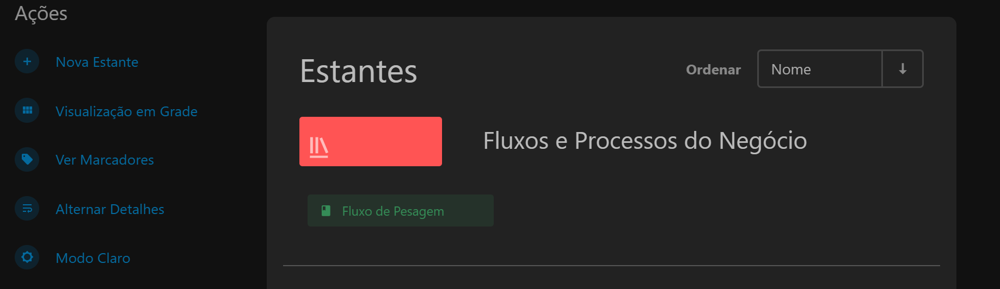
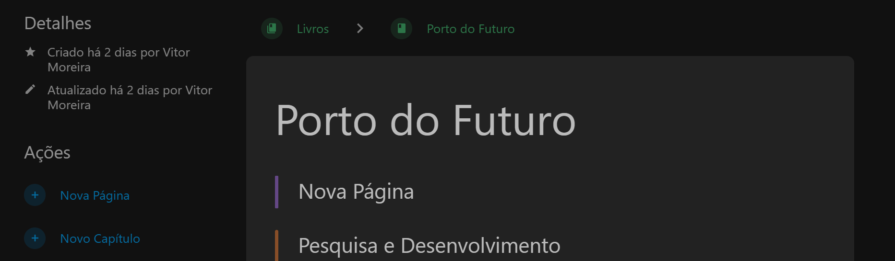

# <center> Documentação técnica

A documentação técnica é uma etapa essencial no ciclo de desenvolvimento de software (SDLC, do inglês Software Development Life Cycle), garantindo que todas as partes interessadas tenham um entendimento claro sobre o sistema. Ela facilita a comunicação, a manutenção e a escalabilidade do projeto, servindo como referência durante todo o processo.

Para a documentação técnica das aplicações desenvolvidas, a GETIN solicita que os desenvolvedores utilizem do projeto docs, onde são compiladas todas as documentações de soluções desenvolvidas para o Porto do Itaqui. 

Dentro da Gerencia de Pesquisa, Desenvolvimento e Inovação, a documentação dos produtos tecnológicos se divide em: Aplicações Low Code e Aplicações de Alto nível. As documentações de projetos desenvolvidos para a EMAP são mantidas dentro do repositório Docs. O processo de documentação pode ser realizado tanto através de arquivos markdown utilizando a biblioteca **mkdocs**, quanto através da própria ferramenta de adição do sistema **Docs**.


## <center> Estrutura básica de uma documentação técnica

A estrutura básica de uma documentação técnica de software deve ser bem organizada e clara, para facilitar a compreensão dos leitores, sejam eles desenvolvedores, usuários finais ou outros stakeholders. Abaixo estão os elementos essenciais que geralmente compõem uma boa documentação técnica:

- Overview:
- Getting Started:
- Core componentes and Features
- Best pratices
- Integrations with external services
- Troubleshooting and suport
- Cases

## <center> Docs

O [Docs](https://captcha.portodoitaqui.com/?redirect=https://docs.portodoitaqui.com/) é um sistema web desenvolvido para armazenamento e compartilhamento de documentações técnicas em formato de markdown das soluções de base tecnológica desenvolvidas para o Porto do Itaqui. O sistema é monitorado pela Gerência de Tecnologia da Informação (GETIN) e o acesso deve ser solicitado para a mesma via servicedesk.


### Criando documentação no Docs

Para desenvolver a documentação do projeto no sistema Docs, como requisito é necessário a solicitação de acesso ao sistema via **service desk**. 


Para criar uma nova estande (Documentação de projeto), o desenvolvedor deve selecionar a opção **nova estante** localizada no menu vertical ao lado esquerdo da tela. 



Com a estante já criada, para adicionar e editar novas páginas à documentação, o usuário deve selecionar a opção **novo capítulo** no menu vertical localizado no lado esquerdo da tela.



>A documentação deve ser escrita seguindo a sintaxe da linguagem Markdown. Para mais informações acesse a [documentação oficial](https://www.markdownguide.org/).

## <center> Documentação manual utilizando MkDocs

A documentação técnica "manual" do projeto deve ser feita em formato markdown e recomenda-se a utilização da biblioteca MKdocs para o desenvolvimento do arquivo. 

MkDocs é um gerador de sites estáticos rápido, simples, voltado para a criação de documentação de projetos. Os arquivos de origem da documentação são escritos em Markdown e configurados com um único arquivo de configuração YAML.

### Instalação do MkDocs

Com o vscode aberto e localizada no repositório do projeto que deve ser documentado, para instalar o MKDocs, rode o seguinte comando na linha de comandos do terminal.

```
pip install mkdocs
```

### Criando um projeto docs

Para criar um novo projeto, execute o seguinte comando no terminal:

```
mkdocs new my-project
cd my-project
```


Há um único arquivo de configuração chamado mkdocs.yml e uma pasta chamada docs que conterá os arquivos de origem da sua documentação (docs é o valor padrão para a configuração docs_dir). Neste momento, a pasta docs contém apenas uma página de documentação, chamada index.md.

O MkDocs vem com um servidor de desenvolvimento integrado que permite visualizar sua documentação enquanto trabalha nela. Certifique-se de estar no mesmo diretório que o arquivo de configuração mkdocs.yml e, em seguida, inicie o servidor executando o comando:

```
mkdocs serve
```

Abra o endereço Para criar um novo projeto, execute o seguinte comando no terminal:


### Construindo site

Para publicar a primeira versão da sua documentação MkLorum. Primeiro, construa a documentação com o seguinte comando:

```
mkdocs build
```

Isso criará um novo diretório chamado site. Para mais informações e detalhes sobre a utilização do Mkdocs, consulte: [Documentação MkDocs](https://www.mkdocs.org/getting-started/)

## <center> Tipos de Documentação

### Documentação para aplicação Low Code

Low-code é uma abordagem inovadora ao desenvolvimento de software que permite a criação de aplicações de forma rápida e eficiente, utilizando ferramentas que minimizam a necessidade de codificação manual. 

Essa metodologia é baseada no uso de interfaces visuais, componentes de arrastar e soltar, e automação para gerar códigos, permitindo que desenvolvedores e outros profissionais participem do processo de desenvolvimento sem necessariamente possuírem habilidades técnicas avançadas.

Os casos de uso de plataformas low-code são diversos e abrangem diferentes áreas de aplicação. Alguns dos principais incluem:

- 1️⃣ **Desenvolvimento de Aplicações Empresariais**

Plataformas low-code são amplamente utilizadas para criar aplicações empresariais voltadas para gestão de processos internos, como CRM, ERP, e sistemas de gestão de contratos. Esses sistemas podem ser personalizados de acordo com as necessidades específicas de cada organização.

- 2️⃣ **Automatização de Processos de Negócio (BPA)**

Empresas utilizam low-code para automatizar fluxos de trabalho manuais e repetitivos, aumentando a eficiência e reduzindo erros. Exemplos incluem aprovações de solicitações, processamento de pedidos e gestão de faturas.

- 3️⃣ **Prototipagem e MVP (Produto Mínimo Viável)**

Startups e equipes de inovação utilizam plataformas low-code para criar protótipos rápidos e MVPs, validando ideias de produtos antes de investir em desenvolvimento completo.

- 4️⃣ **Integração de Sistemas**

O low-code permite conectar diferentes sistemas e bases de dados, criando soluções integradas que melhoram a troca de informações entre departamentos ou organizações.

- 5️⃣ **Criação de Portais e Aplicativos para Clientes**

Muitas empresas criam portais web e aplicativos móveis para interação com clientes, como agendamentos, suporte ou monitoramento de serviços, usando plataformas low-code.

- 6️⃣ **Análise de Dados e Relatórios**
Ferramentas low-code podem ser usadas para desenvolver dashboards e relatórios interativos, facilitando a tomada de decisão baseada em dados.

A documentação de low-code é uma coleção abrangente de recursos, diretrizes e instruções que facilitam o entendimento, a implementação e o uso eficaz de plataformas e ferramentas de desenvolvimento low-code de maneira eficiente, clara e concisa. 

### Documentação de aplicações web

A documentação técnica organiza informações essenciais para o desenvolvimento, manutenção e escalabilidade de projetos web.  

#### 📝 **Principais Tipos de Documentação**  

-  1️⃣ **Requisitos do Projeto**  
Define escopo, funcionalidades e tecnologias.  

-  2️⃣ **Arquitetura do Sistema**  
Diagramas UML, estrutura de banco de dados e fluxo de dados.  

-  3️⃣ **Guia de Configuração e Deploy**  
Passos para instalação, configuração e publicação do projeto.  

-  4️⃣ **Documentação da API**  
Endpoints, métodos, parâmetros e respostas detalhadas (ex.: Swagger).  

-  5️⃣ **Padrões de Código**  
Linting, convenções de nomeação e padrões de commits.  

-  6️⃣ **Modelo de Banco de Dados**  
Diagramas ER e estrutura das tabelas.  

#### 🛠 **Ferramentas Úteis**  
🔹 **Markdown** (GitHub Docs)  
🔹 **Swagger/OpenAPI** (APIs)  
🔹 **Notion, Confluence** (Colaboração)  
🔹 **Docusaurus** (Sites de documentação)  

#### ✅ **Boas Práticas**  
✔ Atualizar frequentemente  
✔ Incluir exemplos claros  
✔ Automatizar sempre que possível  

Documentação bem feita melhora a colaboração e a manutenção do projeto! 🚀

## <center> Intruções (Diretrizes) para Documentação 

| Documentação         | Produto    | 
| --------------- | ----------- |
| Low Code        | [Intruções de documentação Low Code](documentacao-low-code.md) |
| Aplicação Streamlit | [Intruções de documentação Web Ap](documentacao-web-app.md) |
| Aplicação Django | [Intruções de documentação BI]() |
