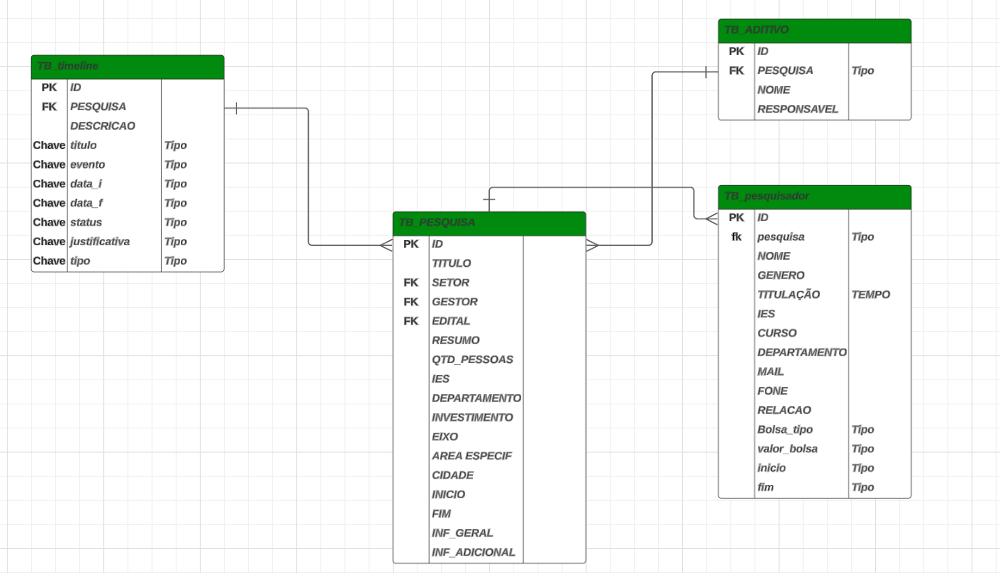

# Modelagem de Dados
A etapa de modelagem de dados no ciclo de desenvolvimento de software é crucial para estruturação e organização de informações que serão manipuladas pelo sistema. Nessa fase, busca-se criar representações abstratas dos dados e suas relações, garantindo que o sistema seja capaz de armazenar, acessar e gerenciar informações de forma eficiente e consistente.
A modelagem de dados divide-se em três fases, modelagem conceitual, onde há a representação dos dados de forma abstrata, normalmente através de um diagrama entidade relação (DER), que, em projetos desenvolvidos pela GEPDI, utiliza-se a ferramenta lucidchart;  A modelagem lógica, traduz o modelo conceitual em um formato mais detalhado, independente de tecnologia, mas com maior especificidade; por fim, a Modelagem física, onde detalha-se a implementação em um banco de dados específico escolhido (MySQL, SharePoint, Postgress).

## Diagrama Entidade-Relação
A etapa de modelagem de dados no ciclo de desenvolvimento de software é crucial para estruturação e organização de informações que serão manipuladas pelo sistema. Nessa fase, busca-se criar representações abstratas dos dados e suas relações, garantindo que o sistema seja capaz de armazenar, acessar e gerenciar informações de forma eficiente e consistente.
A modelagem de dados divide-se em três fases, modelagem conceitual, onde há a representação dos dados de forma abstrata, normalmente através de um diagrama entidade relação (DER), que, em projetos desenvolvidos pela GEPDI, utiliza-se a ferramenta lucidchart;  A modelagem lógica, traduz o modelo conceitual em um formato mais detalhado, independente de tecnologia, mas com maior especificidade; por fim, a Modelagem física, onde detalha-se a implementação em um banco de dados específico escolhido (MySQL, SharePoint, Postgress).

## Modelagem física
A modelagem física na modelagem de dados é crucial, pois ela transforma o modelo lógico de dados em uma estrutura que pode ser implementada efetivamente em um sistema de gerenciamento de banco de dados (SGBD). Enquanto a modelagem lógica foca na organização e no relacionamento dos dados de uma forma abstrata e independente de plataforma, a modelagem física leva em consideração aspectos específicos do SGBD e da infraestrutura tecnológica onde os dados serão armazenados e manipulados. Dentro do contexto do desenvolvimento de projetos da Gerencia de Pesquisa, Desenvolvimento e Inovação, alguns sistemas de gerenciamento de bancos de dados utilizados são, MySQL , SQL Server, Oracle. 
Ainda sobre SGBD, vale ressaltar a utilização do SharePoint, principalmente em aplicativos desenvolvidos com Low Code, como uma espécie de Sistema de Gerenciamento de Dados. 

## SharePoint
SharePoint é uma plataforma de colaboração da Microsoft usada para gerenciar conteúdo, documentos e informações de maneira eficaz dentro de uma organização. Ele facilita o trabalho em equipe, a comunicação e o compartilhamento de dados, promovendo um ambiente de trabalho digital integrado. O SharePoint é altamente utilizado por empresas para criar sites, intranets e repositórios de documentos, e pode ser implantado tanto em servidores locais (on-premises) quanto na nuvem (via SharePoint Online). Apesar de não ser considerado um SGBD, o SharePoint pode ser utilizado para armazenar informações e dados em desenvolvimento de aplicativos mais simples, além de manter-se dentro da segurança de uma organização.

- Criar um site no SharePoint Online:
    - Selecione + Criar site no Microsoft Office SharePoint Online página inicial.
    - Selecione se você deseja criar um site de equipe ou um site de comunicação.
    - Selecione Usar modelo em branco para começar a criar um site no modelo selecionado.
    - Insira o nome do site. Quando você começa a inserir um nome para o site, outros campos são exibidos.
    - Você pode inserir uma descrição do site e editar o endereço do site e o endereço de email do grupo (para um site de equipe) se desejar.
    - Se solicitado, selecione configurações de privacidade para as informações do site.
    - Selecione Create site.
    - Você pode optar por adicionar membros do site e proprietários, se desejar.
    - Selecione Concluir.
- Adicionar uma lista ou biblioteca de documentos
    - Abra o site ao qual você deseja adicionar a lista ou biblioteca.
    - Selecione Novo.
    - Selecione Lista ou Biblioteca de documentos.
    - Selecione Lista em branco ou biblioteca em branco para adicionar uma lista ou biblioteca de documentos ao site. 
    - No painel Criar:
        - Insira um nome para a lista ou biblioteca (e uma descrição, se desejar).
        - Selecione Criar.

